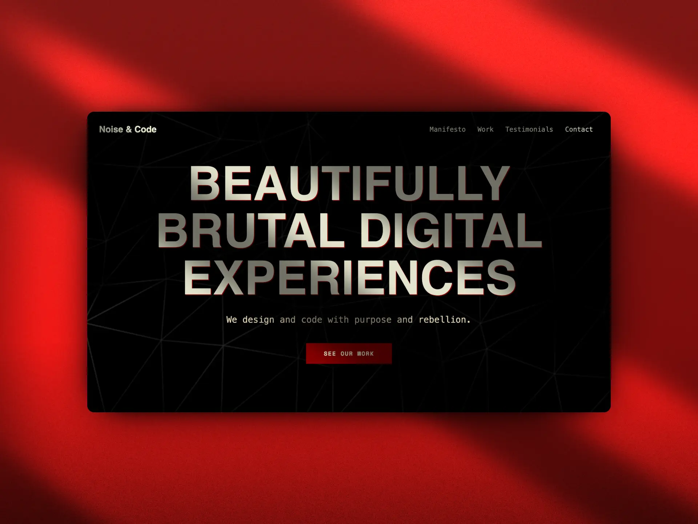

# Noise & Code — Astro Landing Page

**Beautifully Brutal Digital Experiences**
A bold, brutalist-inspired landing page built with [Astro](https://astro.build/) and [Tailwind CSS](https://tailwindcss.com/), featuring glitch effects, video background, and expressive typography.



## 📸 Live Preview

Check out the live site here:
👉 [https://noise-and-code-landing.vercel.app](https://noise-and-code-landing.vercel.app)

---

## 🚀 Tech Stack

- ⚡ [Astro](https://astro.build/)
- 🎨 Tailwind CSS (CDN or configured via config)
- 🎥 Hero background video (from Pexels)
- 🧠 Custom fonts: Unbounded + Space Mono
- 🌈 CSS variables for custom theming
- ✅ Fully static exportable

---

## 📁 Project Structure

```
/
├── public/                  # Static files (images, video, favicon, etc.)
│   └── hero-video.mp4
├── src/
│   ├── components/          # Astro components (Header, Hero, etc.)
│   ├── pages/
│   │   └── index.astro      # Main landing page
│   └── styles/              # Global styles (if extracted)
├── astro.config.mjs         # Astro configuration
├── tailwind.config.js       # Tailwind theme customization
├── package.json             # Project metadata and scripts
└── README.md
```

---

## 🧪 Local Development

1. **Install dependencies**

```bash
npm install
```

2. **Run the dev server**

```bash
npm run dev
```

Visit `http://localhost:4321` to view the site.

---

## 🏗️ Build for Production

```bash
npm run build
```

The final static output will be in the `dist/` folder.

You can preview the production build locally with:

```bash
npm run preview
```

---

## 🌍 Deployment

Deploy the contents of the `dist/` folder to any static hosting service:

- Vercel
- Netlify
- GitHub Pages
- Cloudflare Pages
- Firebase Hosting

---

## 📬 Contact

Want to collaborate or hire us?
📩 **josetgenao26@gmail.com**

---

## 📄 License

MIT © 2025 Jose Tomas Genao Casilla
